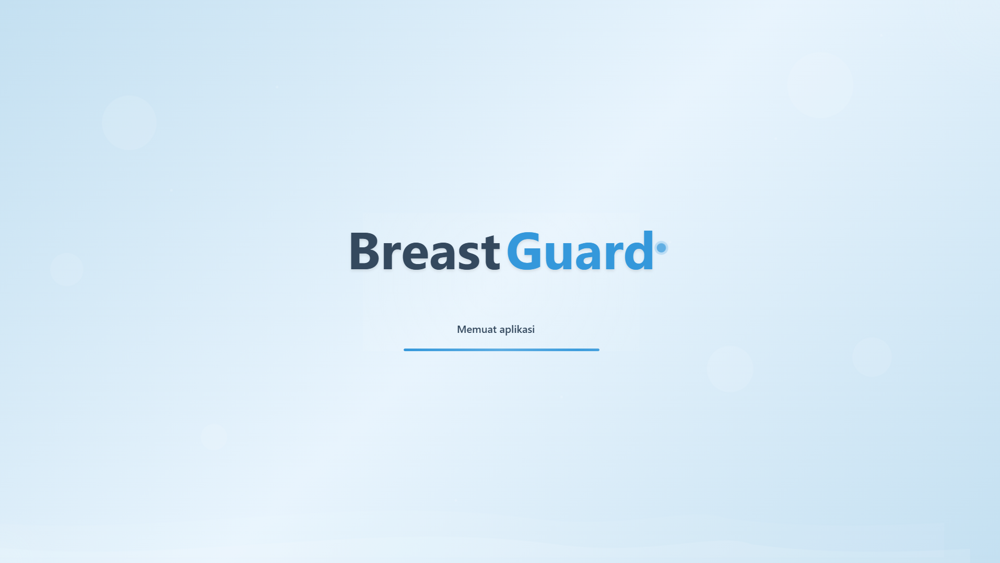
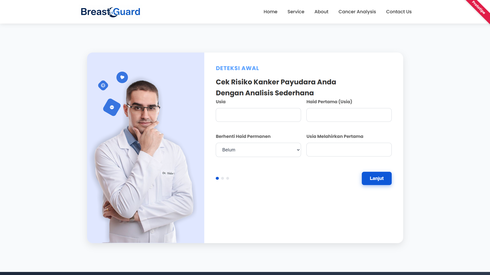

# BreastGuard

**BreastGuard** is a breast cancer risk prediction web application that provides an estimate of your **risk percentage**, complete with **initial lifestyle and medical recommendations** as screening and prevention measures.

This *web application* was built using the **Machine Learning (XGBoost)** model.



---

## Key Features

- Breast cancer risk prediction based on user data input
- Displaying risk percentage
- Initial lifestyle and medical recommendations

---

## Installation & Setup

1. **Clone repo**
```bash
git clone https://github.com/FKfarell17108/breast-guard.git
cd breast-guard
```
   
2. **Create a virtual environment**
```bash
python -m venv venv
source venv/bin/activate   # Linux/Mac
venv\Scripts\activate      # Windows
```

3. **Install dependencies**
```bash
pip install -r requirements.txt
```

4. **Run backend**
```bash
cd backend
flask run
```

5. **Open in browser**
```bash
http://localhost:5000
```


---

## How to Use

1. Enter user data such as age, family history, lifestyle, etc.
2. Click the Predict / Calculate Risk button.
3. View the prediction results in the form of breast cancer risk percentages.
4. Get initial recommendations for screening or prevention measures.



---

https://breastguardweb.netlify.app/

---

## © 2025 Farell Kurniawan

Copyright © 2025 Farell Kurniawan. All rights reserved.  
Distribution and use of this code is permitted under the terms of the **MIT** license.
